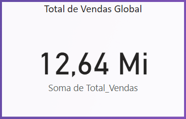
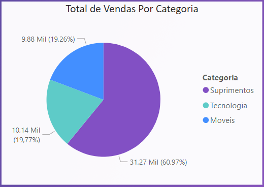
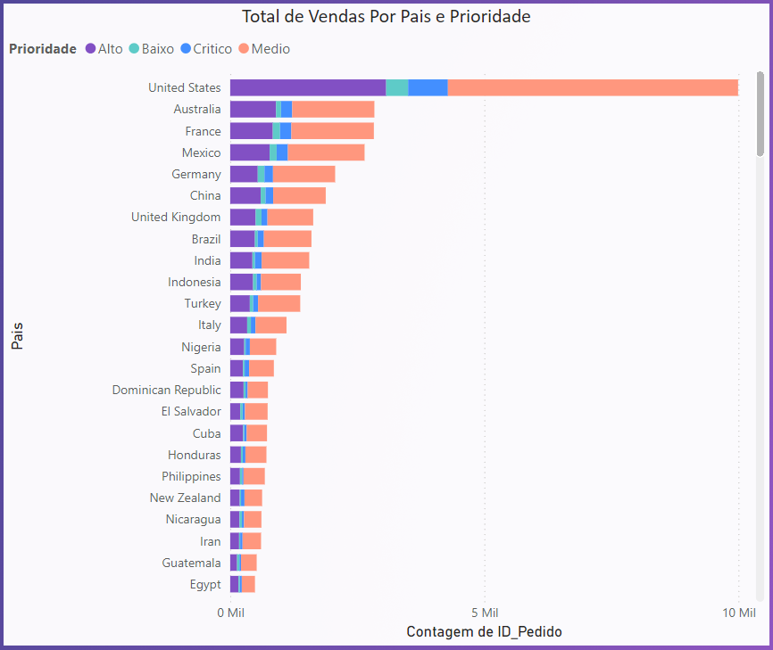

# Análise de Dados de Vendas Globais

Este Dashboard foi criado através do curso gratuito da Data Science Academy de Microsoft Power BI Para Business Intelligence e Data Science, utilizando dados fictícios para a criação de um Dashboard Analítico de Vendas Globais.

## Objetivo

O objetivo deste dashboard é fornecer uma visão abrangente das vendas globais, respondendo às seguintes perguntas:

1. **Qual o valor total vendido?**
   - Primeira pergunta respondida com visualização de um gráfico cartão para mostrar o valor total de vendas.
   - 

2. **Quantas vendas foram realizadas por categoria de produto?**
   - Segunda pergunta respondida com visualização de um gráfico de pizza, para mostrar quantas vendas foram realizadas por categoria de produto.
   - 

3. **Quantas vendas foram realizadas por país considerando a prioridade de entrega?**
   - Terceira pergunta respondida com visualização de um gráfico de barras empilhadas, para mostrar quantas vendas foram realizadas por país considerando a prioridade de entrega.
   - 

4. **Qual foi a média de desconto nas vendas por subcategorias de produto?**
5. **Quais países tiveram maior média de valor de venda? Demonstre em um mapa.**

## Funcionalidades do Dashboard

- **Filtragem de Dados:** O usuário pode filtrar os dados por ano, segmento e país para obter insights específicos.
- **Visualizações Interativas:** Gráficos e mapas interativos que permitem uma análise detalhada dos dados de vendas.

## Visualizações e Insights

1. **Valor Total Vendido:**
   - Exibe o valor total de vendas realizadas no período analisado.

2. **Vendas por Categoria de Produto:**
   - Gráfico de barras mostrando o número de vendas realizadas para cada categoria de produto.

3. **Vendas por País e Prioridade de Entrega:**
   - Tabela ou gráfico de barras segmentado por país e prioridade de entrega, mostrando o número de vendas.

4. **Média de Desconto por Subcategorias de Produto:**
   - Gráfico de colunas exibindo a média de desconto aplicada em vendas para cada subcategoria de produto.

5. **Média de Valor de Venda por País:**
   - Mapa mundi destacando os países com a maior média de valor de venda.

## Como Utilizar

1. **Filtre os Dados:**
   - Utilize os filtros disponíveis para selecionar o ano, segmento e país de interesse.

2. **Interaja com os Gráficos:**
   - Clique nos gráficos para obter detalhes específicos e visualizar os dados de diferentes perspectivas.

## Conclusão

Este dashboard fornece uma análise detalhada das vendas globais, permitindo identificar padrões, tendências e insights valiosos para tomada de decisão. Com ele, é possível entender melhor o desempenho de vendas por categoria de produto, país e outras dimensões relevantes.

---

Feito por: Jeferson Paz

[Cursos na Data Science Academy](https://www.datascienceacademy.com.br)

[Meu GitHub](https://github.com/jeferson-paz)
